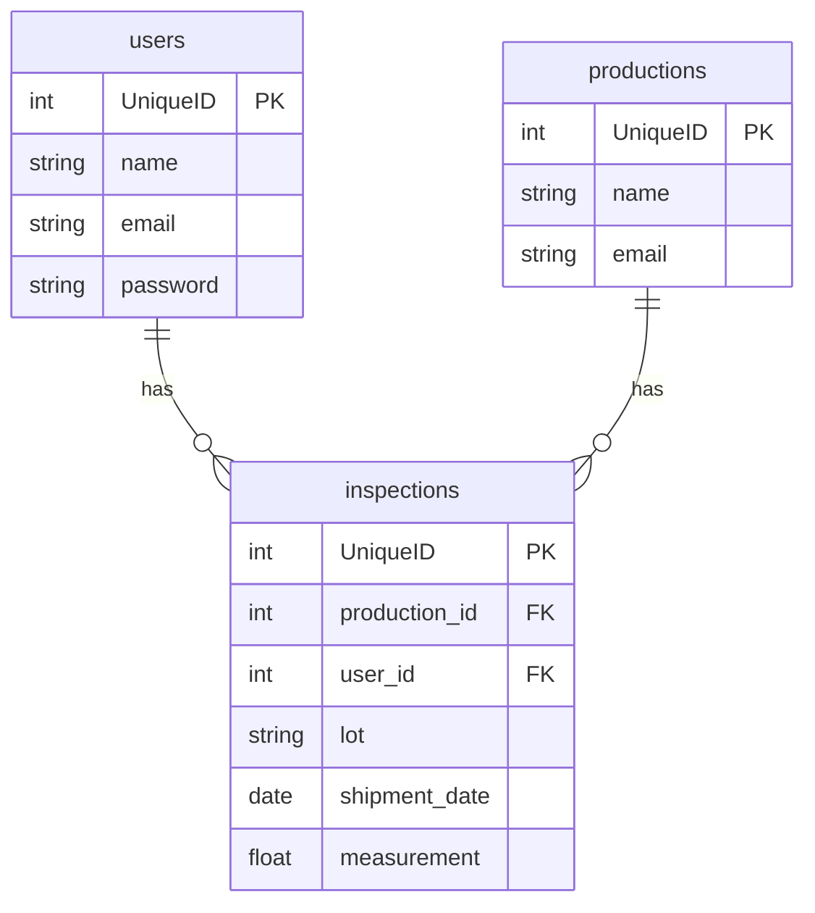

# qctool

工場の製品検査工程におけるデータ管理・可視化を行うWebアプリケーションです。

## 開発環境・公開URL

* **公開URL:** https://qctool-fbts.onrender.com
* **GitHubリポジトリ:** https://github.com/ykymhrt6174/qctool

---

## テスト用ログインアカウント
採用担当者様がすぐに動作確認できるよう、テストデータをあらかじめ用意しております。

```text
admin@example.com
```

```password
password
```

> **備考:** 本アプリはRenderの無料プランでホストしているため、初回のアクセス時のみサーバーの起動に40〜50秒ほど時間がかかる場合があります。また、データの整合性を保つため、コンテナ起動時に自動でデータベースの初期化（`migrate:fresh --seed`）が行われる仕様にしています。

---

## 主な機能一覧

* **ユーザー認証機能** (Breeze)
  * ログイン
* **CRUD（データ操作）機能**
  * 検査データの登録・削除・一覧表示
* **ダッシュボード（可視化）機能**
  * 登録データを元にしたグラフ生成（Chart.jsを使用）
* **[未検査対象を生産日(ロット)順、出荷日順に切り替えられるようにしました]**

---

## 使用技術

### バックエンド
* PHP 8.4-cli
* Laravel 13.12.0

### フロントエンド
* HTML / CSS / JavaScript

### インフラ・データベース
* **Webサーバー:** Render
* **データベース:** Railway (MySQL)

---

## データベース設計（ER図）

---

## ローカル環境での起動方法
他のエンジニアがあなたのコードを手元で動かす際の手順です。

1. リポジトリをクローン
```bash
    git clone https://github.com/ykymhrt6174/qctool.git
    cd qctool
    composer install
    cp .env.example .env
    php artisan key:generate
    php artisan migrate --seed
    php artisan serve
```