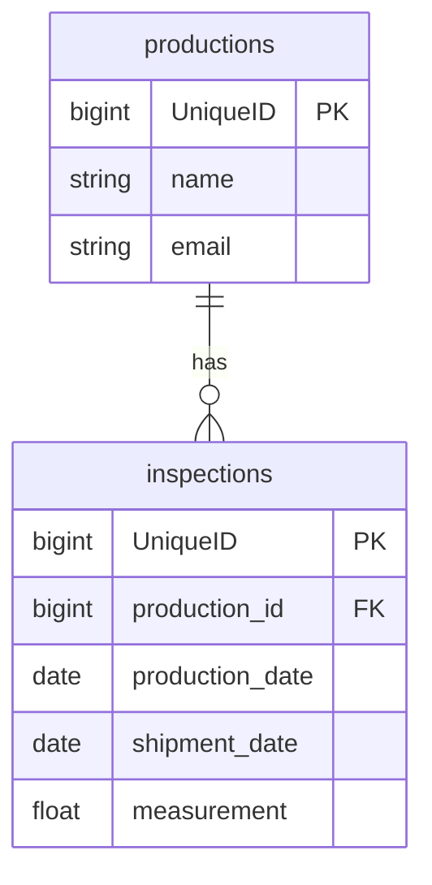

# qctool

工場の製品検査工程におけるデータ管理・可視化を行うWebアプリケーションです。

## 開発環境・公開URL

* **公開URL:** https://qctool-fbts.onrender.com
* **GitHubリポジトリ:** https://github.com/ykymhrt6174/qctool

---

> **備考:** 本アプリはRenderの無料プランでホストしているため、初回のアクセス時のみサーバーの起動に40〜50秒ほど時間がかかる場合があります。

---

## 主な機能一覧

* **CRUD（データ操作）機能**
  * 検査データの登録・削除・一覧表示
* **ダッシュボード（可視化）機能**
  * 登録データを元にしたグラフ生成（Chart.jsを使用）
* **未検査対象を生産日(ロット)順、出荷日順に切り替えられるようにしました**

---

## 使用技術

### バックエンド
* PHP 8.4-cli
* Laravel 13.12.0

### フロントエンド
* HTML / CSS / JavaScript

### インフラ・データベース
* **Webサーバー:** Render
* **データベース:** Railway (MySQL)

---

## データベース設計（ER図）

